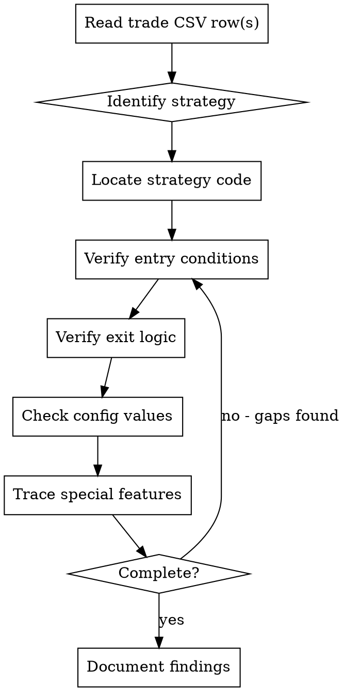

# Analyzing Trade Execution

## Overview

**Systematic trade analysis requires verification, not guessing.** When analyzing trades from CSV logs, you must trace through code to verify actual behavior matches expected strategy logic.

## When to Use

Use when:
- User asks "did this trade execute correctly?"
- CSV data seems contradictory (e.g., SL exit but WIN result)
- Missing or unexpected field values in trade logs
- Need to verify entry/exit conditions were met

Don't use for:
- Strategy design discussions (no specific trade to analyze)
- Performance statistics (use aggregation tools)
- Real-time monitoring (this is post-trade analysis)

## The Verification Process



## Required Verification Checklist

For EVERY trade analysis, verify ALL of these:

### 1. Entry Conditions
- [ ] Read strategy evaluation code (e.g., `evaluate_s3()` in strategy.py)
- [ ] Check what indicators/conditions are required
- [ ] Verify CSV snapshot fields match expected entry criteria
- [ ] If fields are blank, verify if that's expected for this strategy

### 2. Exit Logic
- [ ] Identify exit reason in CSV (SL, TP, PARTIAL_TP, etc.)
- [ ] Check if strategy uses trailing stops (`S3_USE_SWING_TRAIL`, etc.)
- [ ] Understand why SL might = WIN (trailing above entry)
- [ ] Verify if partial TP was taken before final exit

### 3. Strategy Configuration
- [ ] Read `config_s{N}.py` for the strategy
- [ ] Check leverage, trade size, R:R requirements
- [ ] Verify special features (swing trail, scale-in, etc.)
- [ ] Confirm expected vs actual behavior

### 4. Code Tracing
- [ ] Locate where trade is opened in `bot.py` (search for `st.add_open_trade`)
- [ ] Find position monitoring loop (where SL updates happen)
- [ ] Check `paper_trader.py` or `trader.py` for exit execution
- [ ] Verify any special exit handlers (trailing, partial TP)

## Common Misinterpretations

| What You See | Wrong Assumption | Actual Reality |
|--------------|------------------|----------------|
| Exit: SL, Result: WIN | "SL always means loss" | Trailing stop locked in profit, then hit |
| Blank snap_rsi field | "Entry skipped RSI check" | Different strategies use different snapshot fields |
| Multiple same-symbol trades | "Bot entered duplicate" | Valid re-entry after first closed |
| Margin value changed mid-trade | "Calculation bug" | Partial TP or scale-in adjusted margin |

## Investigation Locations

Quick reference for where to look:

| Question | File | What to Search |
|----------|------|---------------|
| What does strategy check at entry? | `strategy.py` | `def evaluate_s{N}(` |
| What config controls behavior? | `config_s{N}.py` | All constants |
| Where does trade open? | `bot.py` | `st.add_open_trade` + strategy name |
| How does exit trigger? | `paper_trader.py` or `trader.py` | `_check_exit`, `update_position_sl` |
| What CSV fields exist? | `bot.py` | Search `_log_trade` CSV header |
| Why is field blank? | `bot.py` | Find where `st.add_open_trade` populates `trade` dict |

## Example Analysis

**CSV Data:**
```csv
2026-03-29T03:06:20,32b7f248,S3_LONG,ARCUSDT,LONG,0.05265,0.05052874,0.05791500,10,52.55,S3,,31.2
2026-03-29T03:22:59,32b7f248,S3_CLOSE,ARCUSDT,LONG,,,,,,,,WIN,3.49,SL
```

**Systematic Verification:**

1. **Strategy**: S3 (15m pullback)
2. **Entry conditions** (read `evaluate_s3()` in strategy.py):
   - ✓ EMA alignment: Check code shows EMA10 > EMA20 > EMA50 > EMA200 required
   - ✓ ADX > 30: CSV shows `snap_adx=31.2`
   - ✓ Stoch oversold then uptick: Code verifies this
3. **Exit logic** (read `config_s3.py`):
   - `S3_USE_SWING_TRAIL = True` ← Key finding!
   - Bot trails SL to nearest 15m swing low as price rises
4. **Why SL = WIN**:
   - Entry: $0.05265, Initial SL: $0.05052874 (4% below)
   - Price rose, SL trailed up to ~$0.0530 (above entry)
   - Price retraced, hit trailed SL → +6.65% profit
5. **Conclusion**: ✅ Trade executed correctly, trailing stop worked as designed

## Red Flags - STOP and Verify

If you catch yourself thinking:
- "This looks obvious, I can tell without checking code"
- "The CSV has all the info, no need to read strategy files"
- "User wants quick answer, thorough analysis takes too long"
- "Missing fields probably aren't relevant"

**All of these mean: STOP. Follow the checklist. Verify don't guess.**

## The Iron Law

```
NO CONCLUSIONS WITHOUT CODE VERIFICATION
```

CSV data alone is insufficient. You must trace through:
- Strategy evaluation logic
- Entry execution code
- Exit monitoring and trailing logic
- Configuration values

Guessing leads to wrong answers. Verification leads to correct answers.
